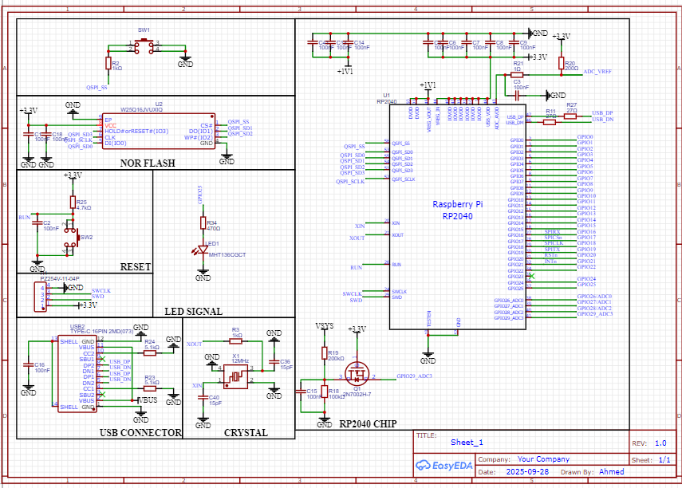

This project is a custom-designed development board based on the Raspberry Pi RP2040 microcontroller.
It is specifically designed for IoT applications that require a stable wired internet connection and power over a single cable.
Key Features
Microcontroller: Raspberry Pi RP2040 (Dual-core Arm Cortex-M0+).

Ethernet: Integrated Wiznet W5500 chip for high-speed wired connectivity.

Power over Ethernet (PoE): Includes a PoE module circuit to power the board directly through the LAN cable.

Storage: Onboard NOR Flash memory for firmware storage.

Connectivity: USB Type-C for programming and debugging.

GPIOs: All essential pins are broken out to easy-to-use headers.

Power Management: Built-in 5V to 3.3V converters for stable operation.

Hardware Details
Controller: RP2040.

Ethernet Controller: W5500.

MagJack: RJ45 with integrated transformers (HY931147C).

Power: Supports USB (5V) and PoE.

How to Use
Clone the repository.

Check the Schematics folder for the EasyEDA/PDF design files.

Use the Raspberry Pi Pico SDK or Arduino IDE (with RP2040 support) to program the board.

### Project Layout and Schematics

#### Schematic View

#### PCB Design - Top Layer

#### PCB Design - Bottom Layer

